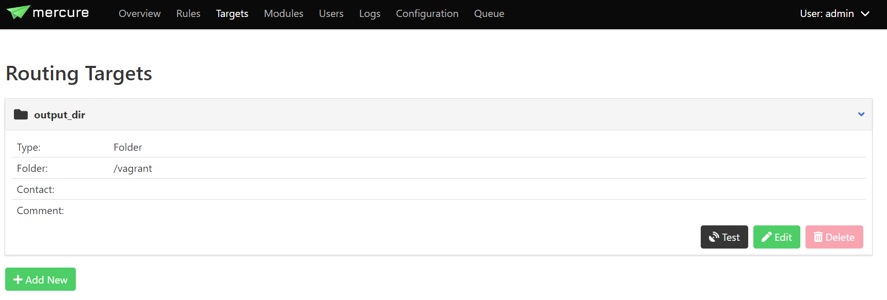
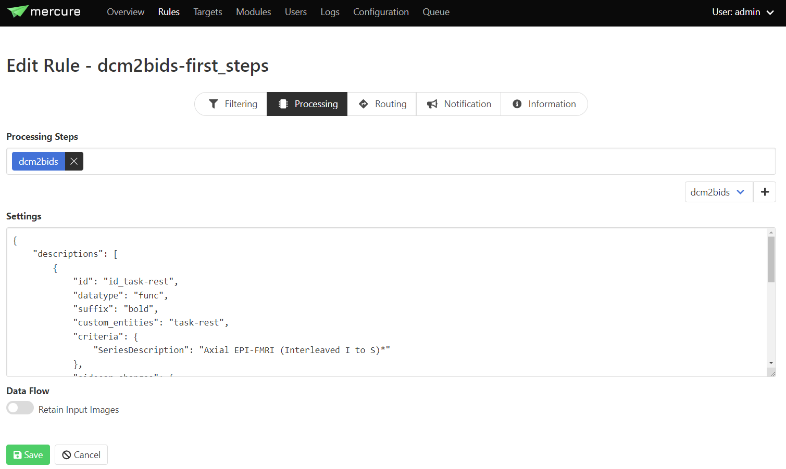

# **mercure-dcm2bids**
 

Mercure module to perform DICOM to BIDS conversion using the [dcm2bids](https://github.com/UNFmontreal/Dcm2Bids) converter. dcm2bids reorganises NIfTI files using dcm2niix into the Brain Imaging Data Structure (BIDS). This module runs as a docker container in mercure, it can be added to an existing mercure installation using docker tag : *mercureimaging/mercure-dcm2bids*. The BIDS configuration .json content can be entered directly into the settings tab in the *Rules* or *Modules* pages of mercure's web-based interactive user interface. The module will generate a .zip file of the BIDS directory structure created using the dcm2bids scaffolding, including the original DICOM files in the *sourcedata* directory and converted BIDS data (see [dcm2bids documentation](https://unfmontreal.github.io/Dcm2Bids) for further details on the scaffold directory structure).

 

## **Installation**

### Add module to existing mercure installation
Follow instructions on [mercure website](https://mercure-imaging.org) on how to add a new module. Use the docker tag *mercureimaging/mercure-dcm2bids*.

 

### Build module for local testing, modification and development
1. Clone repo.
2. Build Docker container locally by running make (modify makefile with new docker tag as needed).
3. Test container :\
`docker run -it -v /input_data:/input -v /output_data:/output --env MERCURE_IN_DIR=/input  --env MERCURE_OUT_DIR=/output mercureimaging/mercure-dcm2bids`

 

## **Configuration**

### Define output directory in *Targets* page in mercure
The mercure-dcm2bids module requires an output directory for the zipped converted data. See example in image below for '/vagrant' directory. Click *test* button to ensure mercure can write to specified directory

 
 

 
 

### Add BIDS configuration file content 
The BIDS configuration for a project can be added to the 'Settings' tab in either the *Modules* or *Rules* pages. Adding the .json content to *Rules* is preferred to allow multiple BIDS configurations to coexist and run with a single dcm2bids module. More information on mercure rule configuration can be found [here](https://mercure-imaging.org/docs/usage.html#defining-rules). An example BIDS configuration based on the dcm2bids [first steps tutorial](https://unfmontreal.github.io/Dcm2Bids/docs/tutorial/first-steps/) is shown in the screenshot below.

 
 

 
 

Full configuration .json text for the first steps example:

~~~
{
  "descriptions": [
    {
      "id": "id-rest"
      "datatype": "func",
      "suffix": "bold",
      "custom_entities": "task-rest",
      "criteria": {
        "SeriesDescription": "Axial EPI-FMRI (Interleaved I to S)*"
      },
      "sidecar_changes": {
        "TaskName": "rest"
      }
    },
    {
      "datatype": "fmap",
      "suffix": "epi",
      "custom_entities": "dir-AP",
      "criteria": {
        "SeriesDescription": "EPI PE=AP*"
      },
      "sidecar_changes": {
        "IntendedFor": "id-rest"
      }
    },
    {
      "datatype": "fmap",
      "suffix": "epi",
      "custom_entities": "dir-PA",
      "criteria": {
        "SeriesDescription": "EPI PE=PA*"
      },
      "sidecar_changes": {
        "IntendedFor": "id-rest"
      }
    }
  ]
}
~~~

